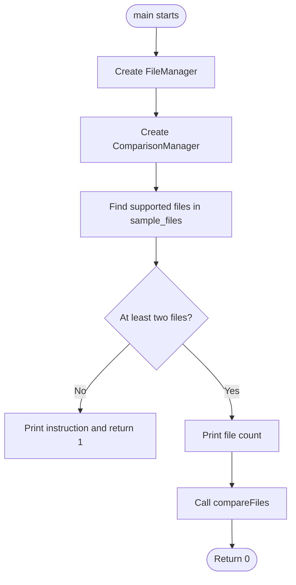

# Entry-point diagram — `main()`

`main()` is a function, not a class, so it does not have a UML class box. This call-flow diagram documents the entry point.

```mermaid
flowchart TD
  A([main starts]) --> B[Create FileManager]
  B --> C[Create ComparisonManager]
  C --> D[Find supported files in sample_files]
  D --> E{At least two files?}
  E -- No --> F[Print instruction and return 1]
  E -- Yes --> G[Print file count]
  G --> H[Call compareFiles]
  H --> I([Return 0])
```
