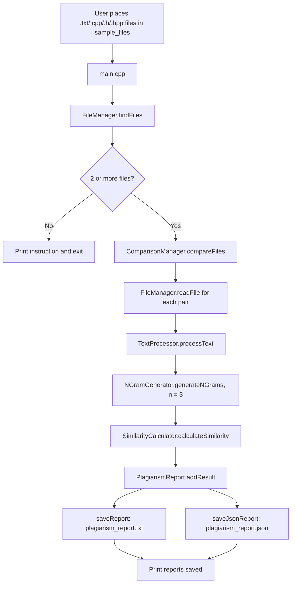

# Architecture — overall application flow

```mermaid
flowchart TD
  U[User places .txt/.cpp/.h/.hpp files in sample_files] --> M[main.cpp]
  M --> FM[FileManager.findFiles]
  FM --> V{2 or more files?}
  V -- No --> MSG[Print instruction and exit]
  V -- Yes --> CM[ComparisonManager.compareFiles]
  CM --> READ[FileManager.readFile for each pair]
  READ --> TP[TextProcessor.processText]
  TP --> NG[NGramGenerator.generateNGrams, n = 3]
  NG --> SC[SimilarityCalculator.calculateSimilarity]
  SC --> PR[PlagiarismReport.addResult]
  PR --> TXT[saveReport: plagiarism_report.txt]
  PR --> JSON[saveJsonReport: plagiarism_report.json]
  TXT --> DONE[Print reports saved]
  JSON --> DONE
```

This reflects the implemented console application. The program compares every pair of discovered files and writes text and JSON reports.
