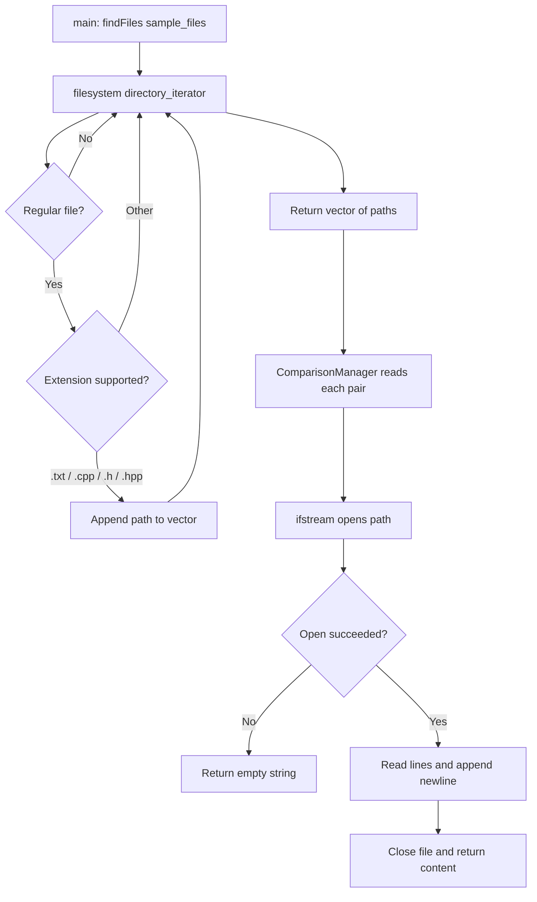

# Architecture — file discovery and reading

```mermaid
flowchart TD
    A["main: findFiles sample_files"] --> B["filesystem directory_iterator"]
    B --> C{"Regular file?"}
    C -- No --> B
    C -- Yes --> D{"Extension supported?"}
    D -- ".txt / .cpp / .h / .hpp" --> E["Append path to vector"]
    D -- Other --> B
    E --> B
    B --> F["Return vector of paths"]
    F --> G["ComparisonManager reads each pair"]
    G --> H["ifstream opens path"]
    H --> I{"Open succeeded?"}
    I -- No --> J["Return empty string"]
    I -- Yes --> K["Read lines and append newline"]
    K --> L["Close file and return content"]
```

The current implementation scans only the specified folder's immediate entries; it does not recursively traverse subfolders.
