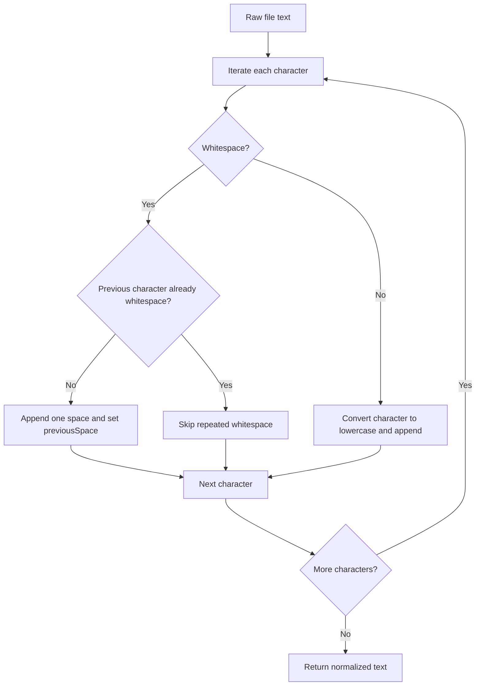

# Architecture — text processing

```mermaid
flowchart TD
  A[Raw file text] --> B[Iterate each character]
  B --> C{Whitespace?}
  C -- Yes --> D{Previous character already whitespace?}
  D -- No --> E[Append one space and set previousSpace]
  D -- Yes --> F[Skip repeated whitespace]
  C -- No --> G[Convert character to lowercase and append]
  E --> H[Next character]
  F --> H
  G --> H
  H --> I{More characters?}
  I -- Yes --> B
  I -- No --> J[Return normalized text]
```

This normalizes case and whitespace. It does not remove punctuation or perform language-aware tokenization.
