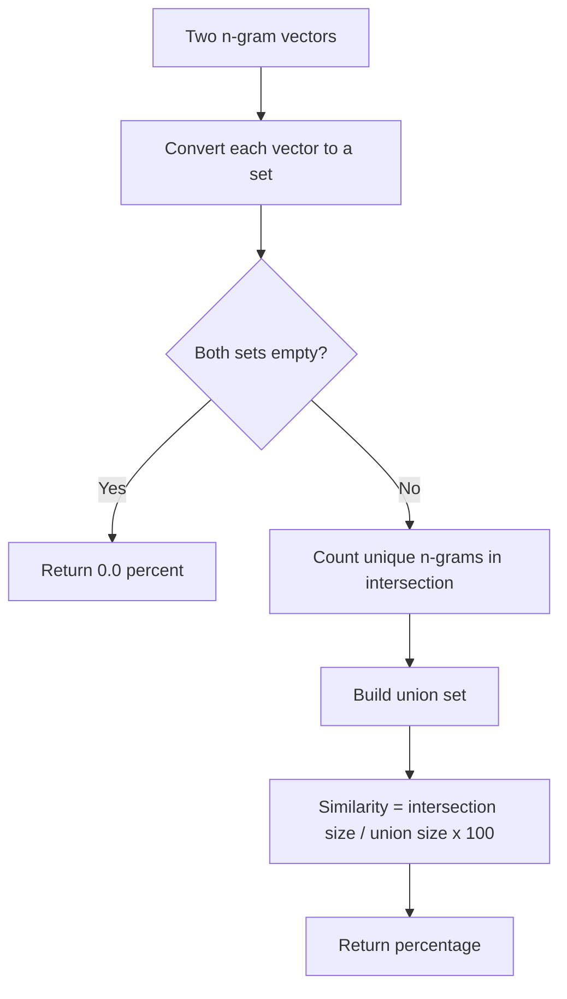

# Architecture — similarity calculation

```mermaid
flowchart TD
  A[Two n-gram vectors] --> B[Convert each vector to a set]
  B --> C{Both sets empty?}
  C -- Yes --> D[Return 0.0 percent]
  C -- No --> E[Count unique n-grams in intersection]
  E --> F[Build union set]
  F --> G[Similarity = intersection size / union size x 100]
  G --> H[Return percentage]
```

This is Jaccard similarity over **unique** n-grams, not a frequency-weighted comparison.
