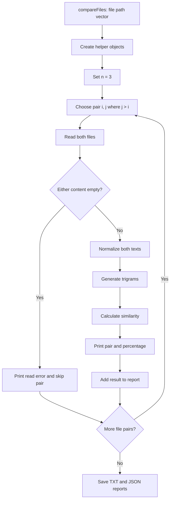

# Architecture — comparison management

```mermaid
flowchart TD
  A[compareFiles: file path vector] --> B[Create helper objects]
  B --> C[Set n = 3]
  C --> D[Choose pair i, j where j > i]
  D --> E[Read both files]
  E --> F{Either content empty?}
  F -- Yes --> G[Print read error and skip pair]
  F -- No --> H[Normalize both texts]
  H --> I[Generate trigrams]
  I --> J[Calculate similarity]
  J --> K[Print pair and percentage]
  K --> L[Add result to report]
  G --> M{More file pairs?}
  L --> M
  M -- Yes --> D
  M -- No --> N[Save TXT and JSON reports]
```

Potential behavior to be aware of: an actually empty file is treated the same as a file that failed to open because both yield empty content.
